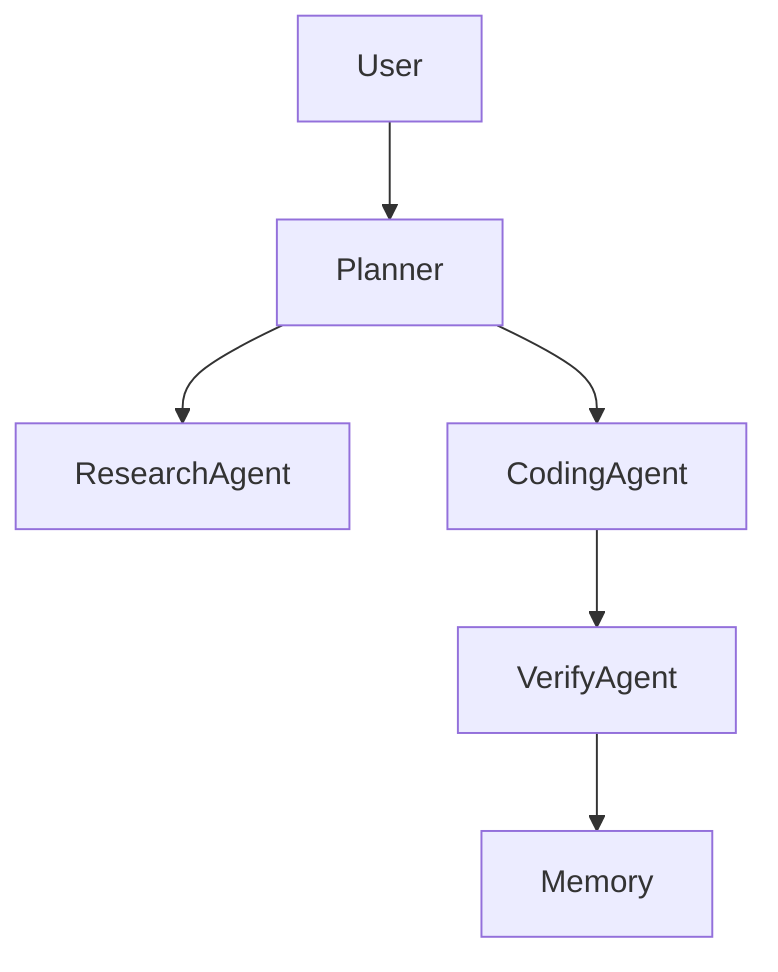

# OmniResearch Agent

Advanced Multi-Agent AI Orchestration Framework
for Autonomous Research and Software Engineering

## Features

- Multi-Agent Collaboration
- DAG Task Execution
- Reflection Memory Loop
- Tool Calling + RAG
- Dynamic Model Routing
- Automatic Verification
- Sandbox Runtime
- Long Context Memory
- Token Optimization
## Quick Start

```bash
git clone https://github.com/yourname/OmniResearch-Agent

cd OmniResearch-Agent

pip install -r requirements.txt

uvicorn backend.main:app --reload
---
```
## Demo Workflow

User Task →
Planner Agent →
Research Agent →
Coding Agent →
Verify Agent →
Reflection Agent →
Final Output
