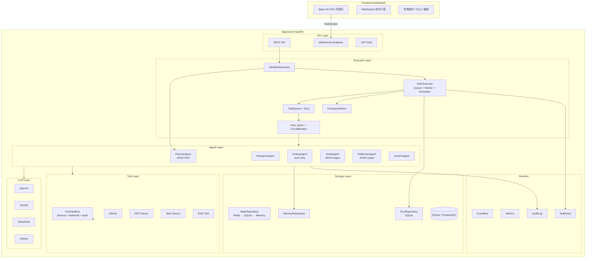
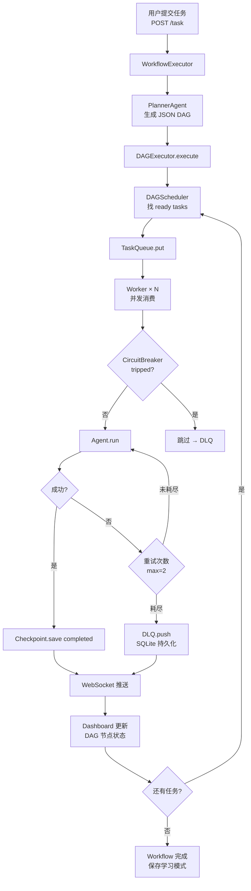
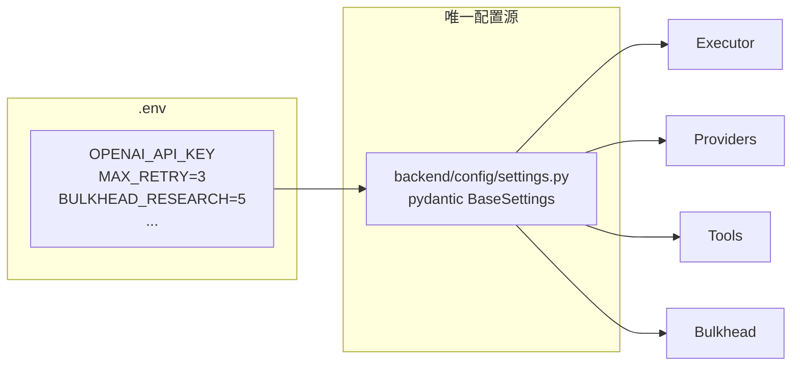
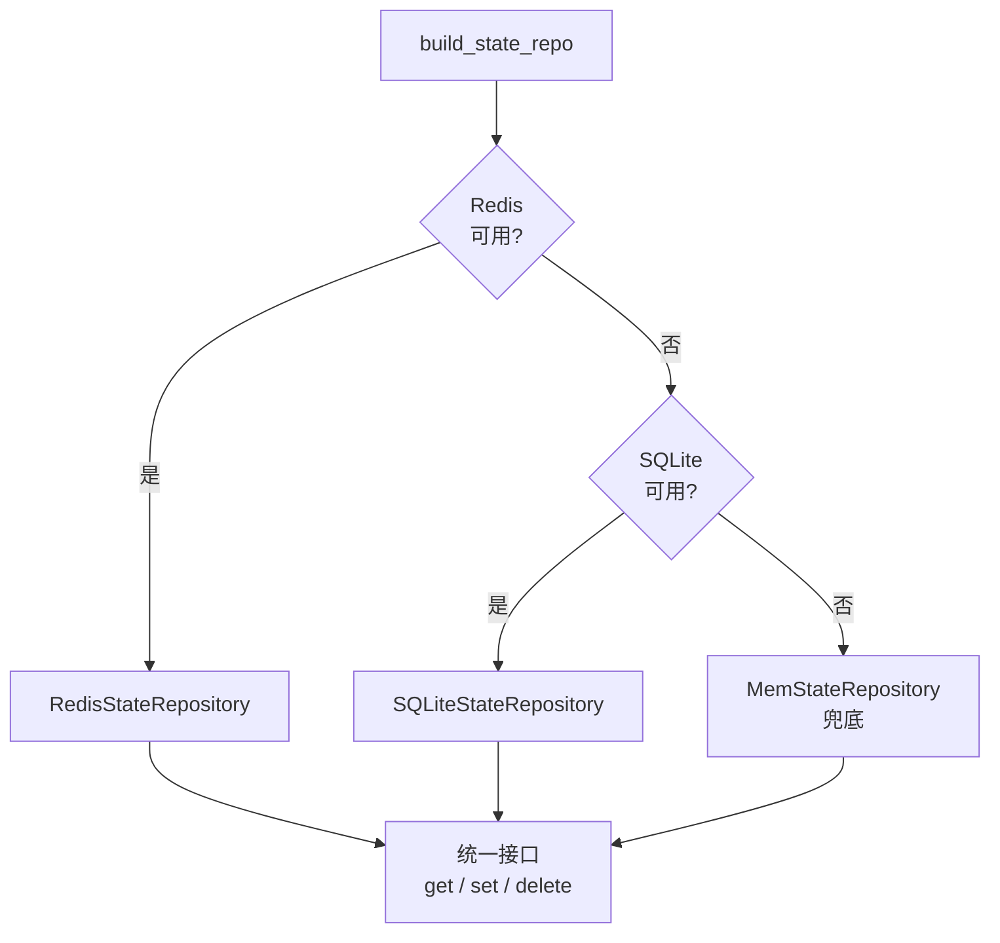

# OmniResearch Agent — 架构文档

## 系统架构图



## 任务执行流程



## 配置系统



## 状态降级策略



## 目录结构

```
backend/
├── agents/           # Agent 层
│   ├── registry.py         # Factory 模式注册表
│   ├── planner_agent.py    # JSON DAG 规划
│   ├── research_agent.py
│   ├── coding_agent.py     # 自动重试
│   ├── verify_agent.py     # JSON 输出
│   ├── reflection_agent.py # JSON 输出
│   └── autofix_agent.py
│
├── executor/         # 执行器层
│   ├── workflow_executor.py   # 唯一入口
│   ├── dag_executor.py        # Queue + Worker + Scheduler
│   ├── dag_scheduler.py       # 依赖调度
│   ├── worker.py              # 并发 Worker
│   ├── task_queue.py          # asyncio.Queue + DLQ
│   ├── checkpoint.py          # Redis 状态持久化
│   ├── dlq_worker.py          # 延迟自动重试
│   └── retry.py               # 指数退避重试
│
├── tools/            # 工具层
│   ├── sandbox.py             # 统一执行入口
│   ├── router.py              # 工具选择
│   ├── circuit_breaker.py     # 熔断器
│   └── tool_audit.py          # 调用审计
│
├── llm/              # LLM 层
│   ├── provider_factory.py
│   ├── openai_provider.py
│   ├── gemini_provider.py
│   └── deepseek_provider.py
│
├── runtime/          # 运行时
│   ├── bulkhead.py            # 统一并发控制
│   ├── workflow_state.py      # Redis 运行态
│   └── runtime_state.py       # 全局状态
│
├── storage/          # 存储层
│   ├── state_repository.py    # 抽象接口
│   ├── sqlite_state.py
│   ├── redis_state.py
│   ├── mem_state.py           # 兜底
│   ├── state_factory.py       # 自动降级
│   ├── dlq_repository.py      # SQLite DLQ
│   └── repository.py          # SQLAlchemy CRUD
│
├── config/
│   └── settings.py            # 唯一配置源
│
├── api/
│   ├── routes_task.py
│   ├── routes_executor.py
│   ├── routes_auth.py
│   ├── routes_dlq.py
│   ├── routes_dashboard.py
│   └── routes_dashboard_ws.py
│
frontend/
└── index.html                 # dagre-d3 Dashboard

tests/
├── conftest.py                # Mock LLM
├── test_state_store.py
├── test_dlq.py
├── test_bulkhead.py
├── test_scheduler.py
└── test_retry.py

archive/executor/              # 归档旧文件
```

## 统一入口

```python
# 执行任务
from backend.executor.workflow_executor import WorkflowExecutor
executor = WorkflowExecutor()
result = await executor.execute("Analyze GitHub repo")

# 配置
from backend.config.settings import settings
settings.OPENAI_TIMEOUT  # 60

# 状态存储
from backend.storage.state_factory import build_state_repo
store = await build_state_repo()  # Redis → SQLite → Memory

# 并发控制
from backend.runtime.bulkhead import research_bulkhead
result = await research_bulkhead.run(agent.run(task))

# DLQ
from backend.storage.dlq_repository import DLQRepository
dlq = DLQRepository()
await dlq.add_task("task_id", retries=0)
```
